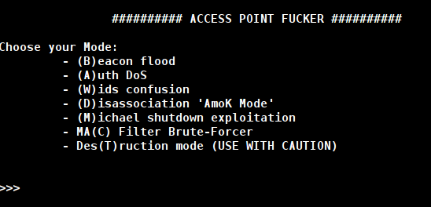

# AP-Fucker
BUENO HEMOS VISTO DIVERSAS HERRAMIENTAS QUE AP-FUCKER NOS OTORGA PARA ATACAR UN ROUTER. TODAS Y CADA UNA DE ELLAS TIENEN UNA IMPLEMENTACIÓN DIFERENTE... QUE LAS DISTINGUE DE MANERA UNÍVOCA DE LAS DEMÁS.  AHORA BIEN, ¿QUÉ ME DECÍS SI TRATAMOS DE FUSIONAR TODAS DE GOLPE?, ESTARÍA BASTANTE INTERESANTE. ESTOS SEÑORES YA SE PLANTEARON LO MISMO Y PROBARON. EL DESTRUCTION MODE NOS PERMITE FUSIONAR LOS ATAQUES BEACON FLOOD, AUTH DOS, MICHAEL SHUTDOWN EXPLOITATION Y EL DEAUTH FLOOD 'AMOK' MODE.

# Como usar

$ git clone https://github.com/RIP-Network/AP-Fucker

$ cd AP-Fucker

$ python2 AP-Fucker.py

$ Imagenes

